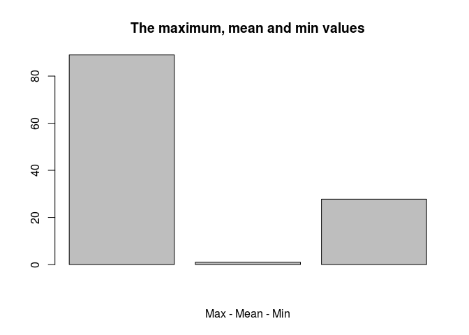

# Building a package
namanpaul  
November 18, 2015  


**I bet there is no easy way of learning how to build a package. Thanks to @jennybc and her team for putting up the best documentation and step-by-step guide to do this task of package building!**

This package is an extension of the [STAT-547M classwork](http://stat545-ubc.github.io/packages00_index.html).

---

The functions were developed in class and the last one as homework:

- `fbind()`
- `freq_out()`
- `m3plot()`

---

##Installing my package `hw08`

Make sure you load the devtools package

`library(devtools)`

Copy and paste the code below to install the package (It works, I checked yay! :smile: )

`devtools::install_github("namanpaul/hw08")`

---

##Loading the package `hw08`

`library(hw08)`


---

**Not repeating the redundant usage of `fbind()` and `freq_out()`**

##However `m3plot()` is easy to use

- This function takes in a numeric vector as input, and plots the maximum, mean and minimum values.
- The major inspiration, to create this function for better visualization of the data, as per @jennybc 
- Not very high productive value, but its a quick way to have a glance how the maximum and minimum values look against the mean value on a simple bar plot.

To use this function: 

for example:

we have a numeric vector

```r
num_vector <- c(15,20,34,50,60,77,80,89)
library(hw08)
m3plot(num_vector)
```

 

Please feel free to explore the various directories, within the package for the tests, and vignettes.

---


